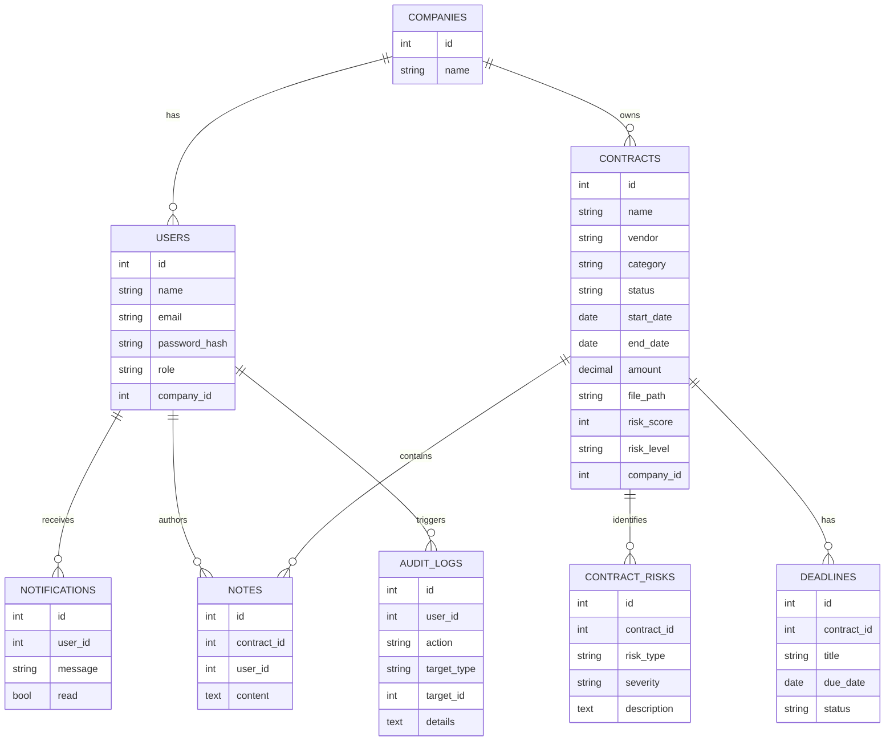

# ER Diagram (Mermaid)

```mermaid
erDiagram
    COMPANIES ||--o{ USERS : has
    COMPANIES ||--o{ CONTRACTS : owns
    USERS ||--o{ NOTIFICATIONS : receives
    USERS ||--o{ NOTES : authors
    CONTRACTS ||--o{ CONTRACT_RISKS : identifies
    CONTRACTS ||--o{ DEADLINES : has
    CONTRACTS ||--o{ NOTES : contains
    USERS ||--o{ AUDIT_LOGS : triggers

    COMPANIES {
        int id
        string name
    }
    USERS {
        int id
        string name
        string email
        string password_hash
        string role
        int company_id
    }
    CONTRACTS {
        int id
        string name
        string vendor
        string category
        string status
        date start_date
        date end_date
        decimal amount
        string file_path
        int risk_score
        string risk_level
        int company_id
    }
    CONTRACT_RISKS {
        int id
        int contract_id
        string risk_type
        string severity
        text description
    }
    DEADLINES {
        int id
        int contract_id
        string title
        date due_date
        string status
    }
    NOTIFICATIONS {
        int id
        int user_id
        string message
        bool read
    }
    NOTES {
        int id
        int contract_id
        int user_id
        text content
    }
    AUDIT_LOGS {
        int id
        int user_id
        string action
        string target_type
        int target_id
        text details
    }
```
